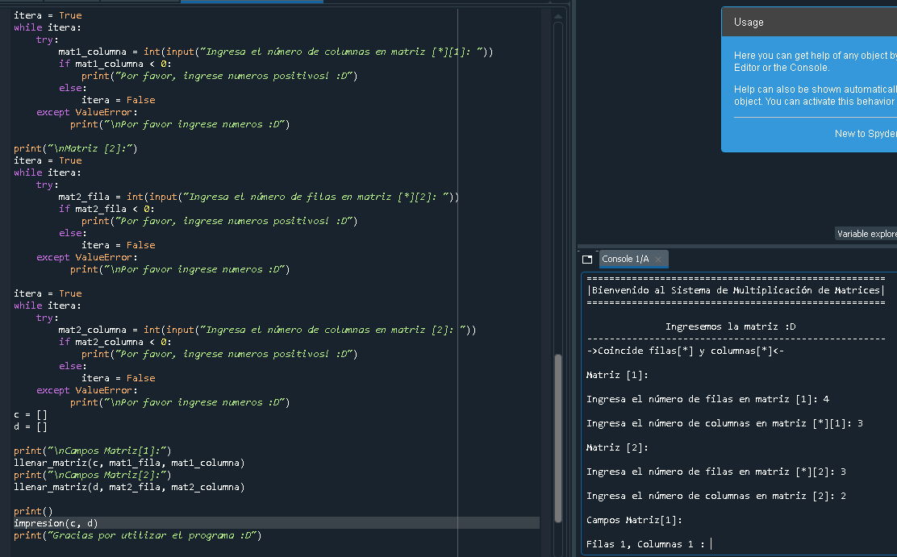
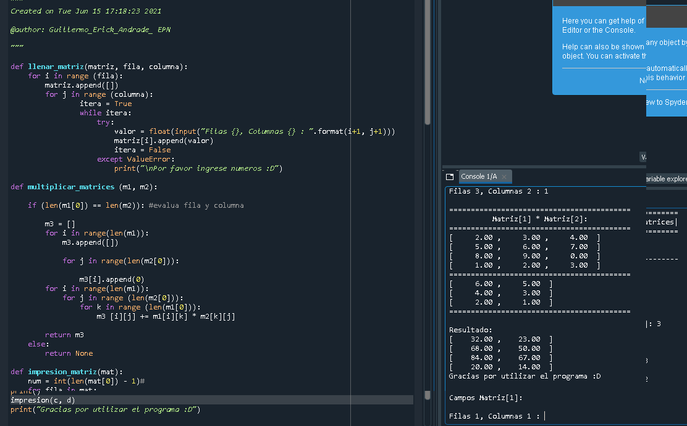

# multi_matrices
### Hola es un trabajo desarrollado por mi, en el cual consiste la multiplicación de matrices en Python.
|Matriz[1]     | Matriz[2]      | Matriz[resultado] |
| ----------|:--------:|-------:|
|filas/columnas|filas/columnas|filas/columnas  
### el cual debe coincidir con las columnas de la 1er Matriz y las filas de la 2da Matriz.
### caso contrario habra un mensaje de error.
```python
Traceback (most recent call last):

  File "C:\Users\aguil\OneDrive\Escritorio\pushMat\Multip_matricesByEAndrade.py", line 131, in <module>
    impresion(c, a)

NameError: name 'a' is not defined
```
### :blush:
``` python
  print("En tal caso una salida correcta sería: ")
```



### :racehorse: :nerd_face: thank you for your attention!